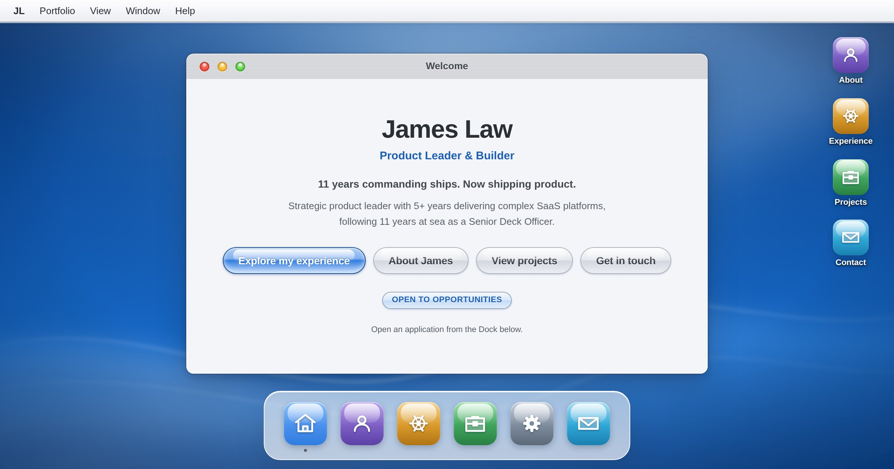

# James Law — Portfolio

**A modern portfolio, disguised as a 2003 desktop.**

The site presents itself as a fictional operating system: an Aqua-blue desktop with
a menu bar, a Dock, and draggable windows, each one an application holding part of
the portfolio. The career content underneath is ordinary, server-rendered,
crawlable HTML.

[](https://jamesslaw.co.uk)

**Live at [jamesslaw.co.uk](https://jamesslaw.co.uk)** — open the applications from
the Dock, or deep-link straight to one: `/#experience`, `/#projects`, `/#skills`.

---

## The guiding constraint

*Old interface. Modern UX.* Where period authenticity conflicted with usability,
usability won:

- **One click opens an application.** A real desktop wanted two.
- **Windows overlap on desktop, and cannot get lost.** A window's left edge is
  pinned to the workspace, because the close, minimise and maximise controls live
  there — letting them slide off would leave a window you can drag but not close.
- **Mobile is a designed application model, not a shrunken desktop.** Its own
  component tree: one full-screen view, nothing draggable, nothing dependent on
  hover, and labelled bottom navigation.
- **Every control is reachable by keyboard**, with visible focus, and window
  controls are labelled by what they do (`Close Experience`) rather than by colour.
- **Nothing decorative pretends to be interactive.** Minimise and maximise are
  absent on mobile rather than inert.

## Stack

| | |
|---|---|
| Framework | Next.js 16 (App Router, React 19, TypeScript) |
| Styling | Tailwind CSS 4 |
| Interface | [Aqua](https://github.com/igorfelipeduca/aqua) primitives, vendored |
| Behaviour | Radix UI (menus, tabs, dialog) |
| Motion | Motion |
| Testing | Vitest, Testing Library |
| Hosting | Vercel |

No window-management or state library: the window manager is a plain reducer.

## Architecture

Four layers, kept deliberately separate:

```
src/
  app/            # routes, metadata, global theme, the 404
  components/
    aqua/         # visual primitives vendored from Aqua (MIT)
    desktop/      # the OS shell — window manager, menu bar, Dock, mobile shell
    apps/         # portfolio applications
    icons/        # original gel icons, inline SVG
  lib/            # content, window configuration, window state, hooks
```

Two decisions shape everything else.

**`page.tsx` stays a server component.** It renders each application's content and
hands it to the client shell, so the portfolio copy is in the initial HTML rather
than appearing after hydration. Windows are never unmounted — one that isn't on
screen is marked `inert`, which takes it out of the tab order and the
accessibility tree while leaving its text crawlable.

**The window manager is a pure reducer** (`lib/window-state.ts`): open, close,
minimise, restore, focus, maximise, move, reflow. Position clamping and the
opening cascade are pure functions, so the behaviour is tested without rendering a
desktop.

## Running it

```bash
npm install
npm run dev        # http://localhost:3000

npm run lint
npm run test:run
npm run build
```

All three checks pass on `main`. Node 20+.

## Quality

**154 tests.** The reducer has full behavioural coverage; the Dock, window chrome
and menu bar are tested for accessible names, keyboard activation and state
transitions. One suite asserts every application's content against `lib/data.ts` —
a guard against the presentation layer quietly losing or altering a career fact.

**Accessibility.** WCAG 2.2 AA is the target. axe-core runs across fifteen states
— every application, a project detail, an open menu, the dialog, a maximised
window, the 404, and mobile at 320px and 375px — and reports one finding, kept
deliberately: a window control partially covered by the window in front of it
falls under the 24px target size. That is inherent to overlapping windows;
keyboard access is unaffected, the exposed portion stays clickable, and one click
brings the window forward. The reasoning is in the plan. Everything else is clean.

Keyboard-only navigation, focus management on open and close,
`prefers-reduced-motion` and contrast ratios are verified rather than assumed.

**Lighthouse.** 100 for accessibility, best practices and SEO on both desktop and
emulated mobile; 100 for performance on desktop and around 90 on emulated mobile.
Performance figures were measured in a throttled container and move a few points
run to run — treat them as indicative rather than exact.

Not verified: Safari and iOS Safari, which need real hardware. Nothing exotic
ships — the newest feature in use is CSS `color-mix()`.

## Documentation

[`docs/aqua-redesign-plan.md`](docs/aqua-redesign-plan.md) is the full record:
what the Aqua library actually provides and where that diverged from the brief,
the decisions taken during each phase and why, the defects found by driving a real
browser, and the findings that were accepted rather than fixed.

## Credits

Interface primitives from [Aqua](https://github.com/igorfelipeduca/aqua) by Igor
Duca, MIT licensed, vendored into `src/components/aqua/` with provenance headers.
Local changes are marked with `FORK` comments and explained.

The wallpaper and every icon are original work. The design takes after Aqua, the
Mac OS X look of 2000–2007; it is not affiliated with or endorsed by Apple.
